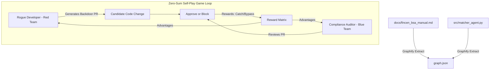

# Fintech AML Compliance Auditor

An automated, reinforcement-learning-powered Pull Request (PR) compliance auditor and transaction screening engine. This system audits codebase modifications for Anti-Money Laundering (AML) compliance violations by combining regulatory documentation into a codebase knowledge graph, utilising adversarial co-training, and providing a human-in-the-loop compliance dashboard.

---

## Mission and Objectives

In modern fintech, minor modifications to transaction matching thresholds can bypass security controls and facilitate trade-based money laundering (TBML) or fraudulent activities. This auditor is designed to:
1. **Bridge the gap between regulatory requirements and source code** using semantic knowledge graphs.
2. **Train a specialised AI compliance auditor (Blue Team)** using **Group Relative Policy Optimization (GRPO)**.
3. **Harden the auditor using self-play** by training a **Rogue Developer (Red Team)** that attempts to inject hidden compliance bypasses in name matching or threshold algorithms improving model accuracy.
4. **Empower Human Compliance Officers** to monitor transaction streams, review raw payloads, and actively train the AI through a visual dashboard.

---

## Why Explore Threshold Alterations? (Business Need & Legal Backing)

In automated payment reconciliation, setting match thresholds represents a constant tension between product growth and regulatory compliance:

### 1. Why Developers and Product Teams Propose Lowering Thresholds
* **Reducing Customer Friction**: Preventing payment delays and checkout abandonment when legitimate customers have slight name formatting discrepancies (e.g., `John Smith` vs `John A. Smith Jr.`).
* **Clearing Operational Backlogs**: Cutting down manual review queues when compliance operations teams are overwhelmed by false-positive halts.
* **Technical Misconception**: Engineers often treat AML name matching as a flexible fuzzy search problem rather than a legally mandated perimeter.
* **Insider Threat Simulation**: Detecting rogue developers who intentionally introduce subtle matching backdoors to allow illicit third-party shell companies to siphon funds.

### 2. The Business Justification
* **Existential Risk Mitigation**: Sponsor banks will freeze payment APIs and regulators will revoke licenses if unauthorised third-party funds flow unmonitored.
* **Cost Efficiency**: Automating the resolution of name variations using a fine-tuned model reduces compliance contractor headcount while keeping the 90% standard intact.
* **Intelligent CI/CD Gatekeeping**: Standard developer testing tools (unit tests, linters) cannot detect that a parameter change represents an AML compliance violation.

### 3. Legal and Regulatory Backing
* **Pillar 1: Trade-Based Money Laundering & AML Programme (FinCEN Advisory FIN-2010-A001 / 31 CFR 1010.210)**: Mandates that automated reconciliation systems identify third-party payments executed by unrelated intermediaries as material red flags requiring manual human-in-the-loop review.
* **Pillar 2: Structuring & Currency Transaction Reporting (31 CFR 1010.100(xx) / 31 U.S.C. 5324(a)(3))**: Legally defines and strictly prohibits structuring transactions in any manner to evade reporting requirements, including breaking down amounts into the $8,500-$9,999 corridor.
* **Pillar 3: Geographic Exposure & Jurisdictional Risk (31 U.S.C. 5318(i) / 31 CFR 1010.610 / FATF Rec. 19)**: Mandates Enhanced Due Diligence (EDD) on transactions and foreign correspondent accounts linked to jurisdictions with strategic AML/CFT/CPF deficiencies and offshore secrecy regimes.
* **Federal Reserve & OCC Model Risk Management Guidance (SR 11-7 / OCC 2011-12)**: Legally classifies transaction matching algorithms as "Models." Altering a matching threshold is classified as a *Material Model Change*, requiring formal validation, risk justification, and documented audit governance.
* **Enforcement Precedent (October 2024 DOJ/FinCEN $3.09B TD Bank Settlement)**: Federal authorities penalised TD Bank $3.09 billion specifically for prioritising a "convenient customer experience" and cost-cutting by suppressing alerts and failing to monitor risky payment channels.

---

## Mechanics: How It Works

This system combines modern reinforcement learning and efficient fine-tuning to train an expert compliance model:

* **Base Model (Qwen-9B)**: Acts as the foundation model for understanding code logic, parsing text, and reasoning about financial flows.
* **LoRA (Low-Rank Adaptation)**: Rather than retraining billions of weights in the base model, the base model is frozen. A lightweight adapter layer is trained(a tiny fraction of the model size of approx. 20MB-50MB) containing compliance-specific knowledge. This reduces training compute requirements by over 98% while achieving high accuracy.
* **GRPO (Group Relative Policy Optimisation)**: Instead of requiring an expensive helper "critic" model, GRPO generates a group of draft reviews for each code change, scores them against FinCEN compliance rules, and adjusts the model based on relative draft quality.
* **Knowledge Graph (Graphify)**: Extracts structural relationships from code ASTs (abstract syntax trees) and regulatory guidelines (docs/fincen_bsa_manual.md) so the model can cite exact legal rules when auditing code.
* **Continuous Feedback Loop**: When a human compliance officer overrides a flagged transaction in the dashboard, the decision is logged and can be used to run incremental fine-tuning epochs that align the model with human judgment.

---

## Architecture



---

## Streamlit Compliance Portal (Demo Overview)

The project includes a human-in-the-loop verification portal (`dashboard.py`). Run the portal locally using:
```bash
streamlit run dashboard.py
```

The portal exposes two key operational areas:

### Tab 1: Pull Request Audits (Code Safety Review)
* **Inbox**: Select from 50 synthetic PR changes generated during testing.
* **AI Auditor Narrative**: Explains the AML compliance risk of the code change, citing FinCEN Advisory FIN-2010-A001 on Trade-Based Money Laundering (TBML) and AML programme rule 31 CFR 1010.210.
* **Compliance Impact Card**: Summarises the system modifications in a non-technical grid (e.g. comparing proposed threshold changes against the 90% FinCEN baseline) for regulators.
* **Decision Centre**: Allows the compliance officer to manually confirm blocks or apply overrides.

### Tab 2: Live Transaction Stream and Halted Funds Escrow
* **Real-time Performance Metrics**: Displays transaction screening counts, auto-routing rates, live AI accuracy, CTR structuring alerts, and escrowed capital.
* **Multi-Vector Risk Scoring Matrix**: Evaluates each transaction across three forensic dimensions:
  * **Vector 1 (Identity Similarity)**: RapidFuzz Levenshtein token sort ratio comparing remitter and customer names against the 90% institutional standard.
  * **Vector 2 (CTR Structuring Detection)**: Detects smurfing patterns in the $8,500 - $9,999 corridor designed to evade mandatory $10,000 Currency Transaction Reporting (31 CFR 1010.100(xx) / 31 U.S.C. 5324(a)(3)).
  * **Vector 3 (Geographic Risk Exposure)**: Flags wire transfers originating from offshore secrecy havens and tax shelters (e.g. Cayman Islands, BVI, Panama) under 31 U.S.C. 5318(i), 31 CFR 1010.610, and FATF Recommendation 19.
  * **Composite AML Risk Index Formula**:
    $$\text{Composite Risk} = 0.50 \times (1 - \text{Identity Score}) + 0.30 \times \text{Structuring Risk} + 0.20 \times \text{Jurisdiction Risk}$$
  * **Weighting Justification & Evidentiary Grounding**:
    * **Identity Discrepancy (50% — Statutory Foundation)**: Under FinCEN Advisory FIN-2010-A001 and federal AML programme requirements (31 CFR 1010.210), identifying unrelated intermediary payments is essential to prevent Trade-Based Money Laundering (TBML). An unverified third-party entity paying on behalf of a client constitutes an immediate red flag; hence, a complete mismatch ($1.0 \times 0.50 = 0.50$) prevents any third-party payment from receiving a clean rating.
    * **Structuring Risk (30% — Criminal Intent Indicator)**: Under 31 CFR 1010.100(xx) and 31 U.S.C. 5324(a)(3), intentionally pitching payments into the $8,500 to $9,999 corridor to evade mandatory $10,000 CTR filings demonstrates deliberate structuring. A 30% weighting ensures active structuring decisively escalates borderline cases into mandatory review.
    * **Jurisdictional Exposure (20% — Contextual Risk Enhancer)**: Under 31 U.S.C. 5318(i), 31 CFR 1010.610, and FATF Recommendation 19, operating via offshore financial centres requires Enhanced Due Diligence (EDD), not automatic prohibition, as legitimate global entities routinely use tax-neutral regimes. A calibrated 20% weighting avoids penalising legitimate commerce whilst acting as a force multiplier when paired with name discrepancies.
  * **Vector Risk Classification Thresholds & Severity Calibration**:
    Each forensic vector and the resulting composite score are categorised into defined risk tiers:

    | Vector / Metric | LOW RISK Tier | MEDIUM RISK Tier | HIGH / CRITICAL RISK Tier | Operational Action |
    | :--- | :--- | :--- | :--- | :--- |
    | **Vector 1: Identity Similarity** | $\ge 90.0\%$ (Verified client match or approved legal suffix) | $70.0\% - 89.9\%$ (Minor spelling variation or entity ambiguity) | $< 70.0\%$ (Unrelated third-party remitter) | Flagged under FIN-2010-A001 & 31 CFR 1010.210; requires manual review. |
    | **Vector 2: Structuring Index** | $< 0.35$ (Normal commercial transaction volume) | $0.35 - 0.69$ (Approaching threshold: $7,000–$8,499) | $\ge 0.70$ (Active $8,500–$9,999 CTR avoidance band) | Flagged under 31 CFR 1010.100(xx) & 31 U.S.C. 5324(a)(3); overrides auto-approval. |
    | **Vector 3: Jurisdictional Risk** | $< 0.35$ (Domestic clearing: US, GB, DE, CA) | $0.35 - 0.59$ (Intermediate preferential regime: MT, GI, LU) | $\ge 0.60$ (Offshore secrecy haven: KY, VG, PA, SC, AE) | Enhanced Due Diligence (EDD) triggered under 31 U.S.C. 5318(i) & FATF Rec. 19. |
    | **Composite AML Risk Index** | $< 0.25$ (`LOW RISK`) | $0.25 - 0.44$ (`MEDIUM RISK`) | $0.45 - 0.69$ (`HIGH`), $\ge 0.70$ (`CRITICAL`) | High/Critical triggers mandatory escrow hold & FinCEN Form 111 SAR dossier. |
* **Automated FinCEN SAR (Form 111) Generator**: Compliance officers can click **`Generate FinCEN SAR`** on any flagged or leaked transaction to produce an official, legally structured Suspicious Activity Report dossier with one-click export for law enforcement submission.
* **Collapsible Details (Raw and Reasoning)**: Allows inspectors to expand any transaction card to view:
  * **Raw JSON Payload**: Complete transaction structure (banking records, accounts, clearing routes, multi-vector forensics).
  * **Deep Reasoning**: Multi-vector forensic breakdown, compliance checklists, and active NetworkX knowledge graph traversal paths.
* **Active Escrow Controls**: Flagged transactions are placed in a `HALTED & ESCROWED` state. Officers can click `Release Funds` or `Seize Funds` to update the transaction state.
* **Interactive Retraining**: If overrides are made on the unaligned model, a banner appears enabling you to click **`Fine-Tune Auditor Model on Overrides`**. This runs an incremental training epoch, updating the policy weights to automatically resolve those edge cases correctly.

---

## Repository Structure

* `docs/fincen_bsa_manual.md`: Three-pillar regulatory compliance manual detailing TBML, structuring, and jurisdictional risk mandates.
* `src/matcher_agent.py`: Baseline name-matching reconciliation engine.
* `src/compliance_graph.py`: Knowledge graph retriever and AST-to-regulatory traversal engine.
* `src/sar_generator.py`: FinCEN Form 111 Suspicious Activity Report dossier generator.
* `generate_poisoned_prs.py`: Script to generate 50 mock pull requests (mix of compliant and poisoned code) for training.
* `train_auditor.py`: Training script for the Blue Team Compliance Auditor via GRPO.
* `red_team_agent.py`: Training script for the Rogue Developer adversarial agent.
* `compliance_engine.py`: Dual-tiered transaction screening and multi-vector risk engine.
* `dashboard.py`: Streamlit human-in-the-loop web portal.
* `tinker.py`: Local SDK wrapper and simulator for offline/API-fallback testing.

---

## Setup and Installation

### 1. Initialize Environment
Set up a local virtual environment:
```bash
python3 -m venv .venv
source .venv/bin/activate
pip install --upgrade pip
```

### 2. Configure Environment Keys
Create a `.env` file in the root directory of the project to store your access credentials. This file is ignored by Git to protect your secrets:
```ini
GEMINI_API_KEY=your-gemini-api-key
```

### 3. Install Libraries and Generate Data
```bash
# Install local dependencies in editable mode
pip install -e /Users/ahmedmirza/git/graphify
pip install -e "/Users/ahmedmirza/git/tinker-cookbook[tutorials]"

# Generate mock PR database
python3 generate_poisoned_prs.py
```

---

## Running the Pipelines

### 1. Rebuild the Knowledge Graph
Ensure your `.env` contains your Gemini credentials and run the extraction:
```bash
# Extract semantic relations
python3 -m graphify extract .
```

### 2. Run Auditor and Red Team Training
Run the RL training scripts:
```bash
# Train Blue Team Auditor
python3 train_auditor.py

# Train Red Team Rogue Developer
python3 red_team_agent.py
```

### 3. Launch the Web Portal
```bash
streamlit run dashboard.py
```
