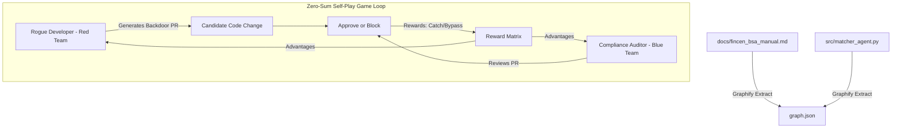

# Fintech AML Compliance Auditor

An automated, reinforcement-learning-powered Pull Request (PR) compliance auditor. This system audits codebase modifications for Anti-Money Laundering (AML) compliance violations by fusing regulatory documentation into a codebase knowledge graph and utilizing adversarial co-training (self-play).

---

## Mission & Objectives

In modern fintech, minor modifications to transaction matching thresholds can bypass security controls and facilitate trade-based money laundering (TBML) or fraudulent activities. This auditor is designed to:
1. **Bridge the gap between regulatory requirements and source code** using semantic knowledge graphs.
2. **Train a specialized AI compliance auditor (Blue Team)** using **Group Relative Policy Optimization (GRPO)** via the Tinker RL SDK.
3. **Harden the auditor using self-play** by training a **Rogue Developer (Red Team)** that attempts to inject hidden compliance bypasses in name matching or threshold algorithms.

---

## Architecture



### 1. Semantic Knowledge Graph (Graphify)
* Parses both structural code ASTs and regulatory guidelines (such as the **FinCEN Customer Due Diligence (CDD) Final Rule - 31 CFR § 1010.230**).
* Creates inferred semantic edges that link python functions to governing regulations, allowing the auditor to query and cite compliance rules directly during PR reviews.

### 2. Reinforcement Learning Loop (Tinker SDK)
* Utilizes **Qwen/Qwen3.5-9B-Base** as the training model.
* Operates on **GRPO** methodologies to center scores within groups of outputs, guiding the agent to use correct tools (`<tool_call>graphify_query`), cite specific regulations, and make the correct compliance decision (`BLOCK` or `APPROVE`).

### 3. Multiplayer RL / Adversarial Red Team
* Evaluates Rogue Developer modifications against the Compliance Auditor.
* Implements a zero-sum reward system:
  * **Rogue Developer**: Gets **+1.0** reward for successfully altering match threshold rules (e.g. lowering fuzzy matching requirements below 90%) without triggering the Auditor's `raise_compliance_gap` detection.
  * **Compliance Auditor**: Gets rewarded for catching and blocking backdoor attempts.

---

## 📂 Repository Structure

* `docs/fincen_bsa_manual.md`: Regulatory manual detailing CDD guidelines and thresholds.
* `src/matcher_agent.py`: Baseline name-matching reconciliation engine.
* `generate_poisoned_prs.py`: Scripts to generate 50 mock pull requests (mix of compliant and poisoned code) for training.
* `train_auditor.py`: Tinker script to train the Blue Team Compliance Auditor via GRPO.
* `red_team_agent.py`: Tinker script to train the Rogue Developer adversarial agent.
* `github_action_auditor.py`: CI/CD handler to run the trained model on incoming PRs.

---

## Setup & Installation

### 1. Clone & Initialize Environment
Set up a local virtual environment:
```bash
# Create and activate environment
python3 -m venv .venv
source .venv/bin/activate

# Upgrade pip
pip install --upgrade pip
```

### 2. Install Cloned Libraries
Install local dependencies in editable mode:
```bash
# Install Graphify
pip install -e /Users/ahmedmirza/git/graphify

# Install Tinker Cookbook (including tutorials / marimo)
pip install -e "/Users/ahmedmirza/git/tinker-cookbook[tutorials]"
```

### 3. Generate the Training Data
Build the synthetic pull request database:
```bash
python3 generate_poisoned_prs.py
```

---

## Usage

### 1. Fuse Legal Docs into the Knowledge Graph
Export your LLM API keys and run Graphify to extract semantic connections:
```bash
export GEMINI_API_KEY="your-gemini-key"

# Run full extract
graphify extract .
```

### 2. Run Auditor Training
Run the GRPO reinforcement learning loop:
```bash
export TINKER_API_KEY="your-tinker-key"

python3 train_auditor.py
```

### 3. Run Adversarial Red Team Training
Run the Rogue Developer RL loop:
```bash
python3 red_team_agent.py
```
