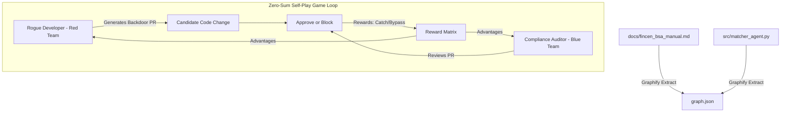

# Fintech AML Compliance Auditor

An automated, reinforcement-learning-powered Pull Request (PR) compliance auditor and transaction screening engine. This system audits codebase modifications for Anti-Money Laundering (AML) compliance violations by fusing regulatory documentation into a codebase knowledge graph, utilizing adversarial co-training (self-play), and providing a human-in-the-loop compliance dashboard.

---

##  Mission & Objectives

In modern fintech, minor modifications to transaction matching thresholds can bypass security controls and facilitate trade-based money laundering (TBML) or fraudulent activities. This auditor is designed to:
1. **Bridge the gap between regulatory requirements and source code** using semantic knowledge graphs.
2. **Train a specialized AI compliance auditor (Blue Team)** using **Group Relative Policy Optimization (GRPO)** via the Tinker RL SDK.
3. **Harden the auditor using self-play** by training a **Rogue Developer (Red Team)** that attempts to inject hidden compliance bypasses in name matching or threshold algorithms.
4. **Empower Human Compliance Officers** to monitor transaction streams, review raw payloads, and actively train the AI through a premium visual dashboard.

---

##  Architecture



### 1. Semantic Knowledge Graph (Graphify)
* Parses structural code ASTs and regulatory guidelines (such as the **FinCEN Customer Due Diligence (CDD) Final Rule - 31 CFR § 1010.230**).
* Creates inferred semantic edges that link python functions to governing regulations, allowing the auditor to query and cite compliance rules directly during reviews.

### 2. Reinforcement Learning Loop (Tinker SDK)
* Tuning is managed using **GRPO** methodologies to center scores within groups of outputs, guiding the agent to use correct tools (`<tool_call>graphify_query`), cite specific regulations, and make the correct compliance decision (`BLOCK` or `APPROVE`).

---

##  Streamlit Compliance Portal (Demo Overview)

The project includes a premium human-in-the-loop verification portal ([`dashboard.py`](file:///Users/ahmedmirza/git/fintech-aml-auditor/dashboard.py)). Run the portal locally using:
```bash
streamlit run dashboard.py
```

The portal exposes two key operational areas:

### Tab 1:  Pull Request Audits (Code Safety Review)
* **Inbox**: Select from 50 synthetic PR changes generated during testing.
* **AI Auditor Narrative**: Explains the AML compliance risk of the code change.
* **Compliance Impact Card**: Summarizes the system modifications in a non-technical grid (e.g. comparing the proposed threshold changes against the 90% FinCEN baseline) for regulators.
* **HITL Decision Center**: Allows the officer to manually confirm blocks or apply overrides.

### Tab 2:  Live Transaction Stream & Halted Funds Escrow
* **Real-time Performance Metrics**: Displays transaction screening counts, auto-routing rates, live AI accuracy, and escrowed capital.
* **Collapsible Details (Raw & Reasoning)**: Allows inspectors to expand any transaction card to view:
  * **Raw JSON Payload**: Complete transaction structure (banking records, accounts, clearing routes).
  * **Deep Reasoning**: Matching similarity scores, compliance checklists, and the Graphify relationship mapping path.
* **Active Escrow Controls**: Flagged transactions are placed in a flashing ` HALTED & ESCROWED` state. Officers can click `Release Funds` or `Seize Funds` to update the transaction state.
* **Interactive Retraining**: If overrides are made on the unaligned model, a banner appears enabling you to click **` Fine-Tune Auditor Model on Overrides`**. This runs an incremental training epoch, updating the policy weights to automatically resolve those edge cases correctly next time.

---

##  Repository Structure

* `docs/fincen_bsa_manual.md`: Regulatory manual detailing CDD guidelines and thresholds.
* `src/matcher_agent.py`: Baseline name-matching reconciliation engine.
* `generate_poisoned_prs.py`: Scripts to generate 50 mock pull requests (mix of compliant and poisoned code) for training.
* `train_auditor.py`: Tinker script to train the Blue Team Compliance Auditor via GRPO.
* `red_team_agent.py`: Tinker script to train the Rogue Developer adversarial agent.
* `compliance_engine.py`: Dual-tiered transaction screening and routing engine.
* `dashboard.py`: Streamlit human-in-the-loop web portal.
* `tinker.py`: Local Tinker SDK wrapper and simulator for offline/API-fallback testing.

---

##  Setup & Installation

### 1. Initialize Environment
Set up a local virtual environment:
```bash
# Create and activate environment
python3 -m venv .venv
source .venv/bin/activate
pip install --upgrade pip
```

### 2. Configure Environment Keys
Create a `.env` file in the root directory of the project to store your access credentials. This file is ignored by Git to protect your secrets:
```ini
TINKER_API_KEY=your-tinker-api-key
GEMINI_API_KEY=your-gemini-api-key
```

### 3. Install Libraries & Generate Data
```bash
# Install local dependencies in editable mode
pip install -e /Users/ahmedmirza/git/graphify
pip install -e "/Users/ahmedmirza/git/tinker-cookbook[tutorials]"

# Generate mock PR database
python3 generate_poisoned_prs.py
```

---

##  Running the Pipelines

### 1. Rebuild the Knowledge Graph
Ensure your `.env` contains your Gemini credentials and run the extraction:
```bash
# Extract semantic relations
python3 -m graphify extract .
```

### 2. Run Auditor & Red Team Training
Run the RL training scripts (they automatically authenticate using the keys in your `.env`):
```bash
# Train Blue Team Auditor
python3 train_auditor.py

# Train Red Team Rogue Developer
python3 red_team_agent.py
```
